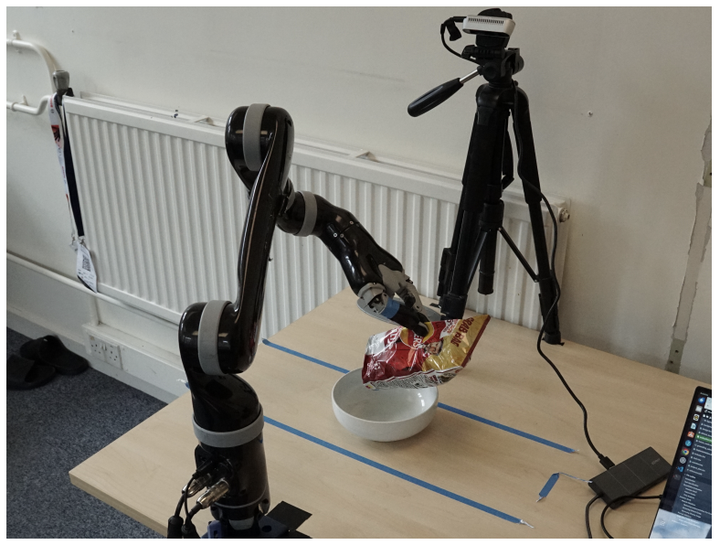

# GPT Powered Robotic Agent



My final year project focusing on using large language models to generate code for robot control.

## Project Setup

This project requires Conda for setting up the necessary environments. Follow the instructions below to get everything up and running.
Once each environment is created, 

### Conda Environments

You will need to create multiple Conda environments, each defined in the `conda_envs_requirements/` directory. Each environment has its own corresponding YAML file.

To create an environment, use the following command:

```bash
conda env create -f conda_envs_requirements/environment_1.yaml
```

### Installing the Project

After setting up the environments, you need to install the project itself as a package. Navigate to the root of your project and run:

```bash
pip install -e .
```

This will install the project in editable mode, allowing you to make changes without needing to reinstall.

### Additional Dependencies

Two additional packages, **LangSAM** and **Contact GraspNet**, are required for this project. Follow their respective installation instructions from their repositories:

- **LangSAM**: Follow the instructions at [LangSAM GitHub](https://github.com/luca-medeiros/lang-segment-anything).
- **Contact GraspNet**: Follow the instructions at [Contact GraspNet GitHub](https://github.com/NVlabs/contact_graspnet).

Make sure to clone their repositories and follow the setup steps carefully to avoid any issues.

```bash
# Example of cloning a repository (do this for both LangSAM and Contact GraspNet)
git clone https://github.com/username/repository_name.git
cd repository_name
# Follow the specific setup instructions provided in their README
```
